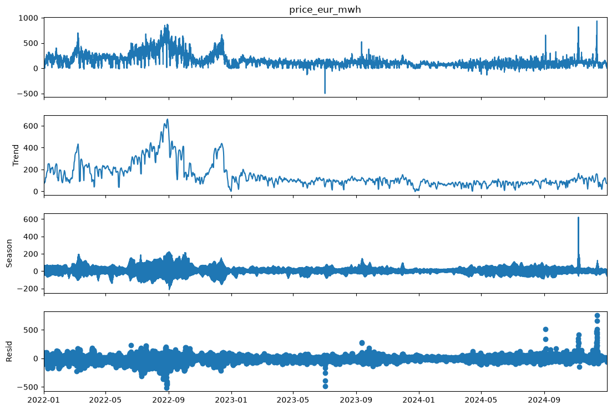

# German Power Price Analysis

## Analysis: The 2022 Energy Crisis and What Came After

### The question
German day-ahead prices are famous for two things: the 2022 energy crisis, and increasingly frequent negative prices. Are these two sides of the same story — or opposites? This project set out to find out, starting from a narrower question ("do negative-price shocks revert quickly?") that led to a more revealing one once the data pushed back.

### What the trend reveals



An STL decomposition (`period=24`, capturing the daily price cycle) splits the raw series into trend, seasonal, and residual components. The trend panel makes the story visible at a glance: a sustained price spike peaking near €650/MWh around August 2022 — the European energy crisis, driven by gas supply shocks following the Russia-Ukraine war — followed by a steady decline back to a much lower, flatter regime through 2023-2024. The seasonal panel adds a second detail: the daily peak-to-trough swing was itself far larger during the crisis (±200 €/MWh) than after (±50-80 €/MWh) — price *volatility*, not just price *level*, was elevated during the crisis.

### Crisis era vs. normal era, side by side

| | Crisis era (2022-01 – 2023-02) | Normal era (2023-03 – 2024-12) |
|---|---|---|
| Mean price | €219.80/MWh | €83.67/MWh |
| Median price | €190.95/MWh | €86.91/MWh |
| Std. deviation | €139.38/MWh | €49.71/MWh |
| Min price | -€19.04/MWh | **-€500.00/MWh** |
| Max price | €871.00/MWh | €936.28/MWh |
| Negative-price hours | 82 / 10,175 (**0.8%**) | 744 / 16,126 (**4.6%**) |

### The finding

The result runs counter to the intuitive story. Negative prices are not a crisis-era phenomenon — they're almost its opposite. During the crisis, scarcity was the defining feature of the market: gas was expensive, demand for alternatives was acute, and the grid essentially never had a surplus moment — only 0.8% of hours went negative, and even those were mild (worst case -€19/MWh). Once the crisis eased, negative prices became **nearly six times more frequent** (4.6% of hours) and far more extreme, including the single most negative hour in the dataset (-€500/MWh).

Read through the lens of the merit order model: negative prices occur when inflexible, low-marginal-cost generation (wind, solar, must-run nuclear) exceeds demand, and producers pay to keep running rather than shut down. The crisis-era market was too *scarce* for that condition to arise; the post-crisis market — with lower demand pressure and a grid increasingly shaped by renewable output — created the oversupply conditions that produce negative prices far more often. Abundance, not stress, is what pushes prices below zero.

This also reframes an earlier finding from this project: an event study of what happens in the hours following a negative-price shock found only partial same-day recovery, with prices still depressed (relative to their usual hour-of-day level) a full 24 hours later — suggestive of multi-day weather-driven regimes rather than isolated hourly blips. Since 90% of all negative-price events in the dataset occur in the normal era, that finding is best understood as a normal-era result, largely unaffected by the crisis period's very different dynamics.

### Project Setup

**Aim:** This project conducts time series analysis of hourly German day-ahead electricity prices from ENTSO-E, focusing on seasonality, spikes, and negative price trends.

**Motivation:** Investigate the occurrence of negative prices and explain them in terms of the merit order model.

## Setup

1. Create and activate a virtual environment (`.venv`).
2. Install dependencies:
```
pip install -r requirements.txt
pip install -r requirements-dev.txt
```
3. Get a free API key from the [ENTSO-E Transparency Platform](https://transparency.entsoe.eu/) (Account Settings → Web Service).
4. Copy `.env.example` to `.env` and add your key:
```
ENTSOE_API_KEY=your_key_here
```
`.env` is gitignored and never committed — `.env.example` documents the required variable without exposing a real secret.

## Usage

Fetch day-ahead prices for a date range and bidding zone:
```
python src/fetch_prices.py --start 2022-01-01 --end 2025-01-01 --out data/de_day_ahead_prices_2022_2024.csv
```
The script chunks requests by year to stay within platform limits, and stores timestamps in UTC.

Then open `notebooks/explore_prices.ipynb` to load the CSV and explore the data — it reads the static output file rather than calling the API directly, so analysis stays reproducible and doesn't re-hit ENTSO-E on every run.

## Data Notes

- Germany's ENTSO-E bidding zone is `DE_LU` (Germany-Luxembourg), effective since the Oct 2018 bidding zone split. The old `DE` code fails for dates after that split.
- Timestamps are stored in UTC. The underlying market data is published in local time (`Europe/Berlin`), so spring DST transitions ("clocks forward") appear as a missing hour in the raw feed — this is expected, not a data quality issue.
- Negative prices are a real, economically meaningful phenomenon (oversupply from renewables/must-run generation exceeding demand), not an error condition.

## Project Structure
```
de-power-price-analysis/
├── src/
│   ├── fetch_prices.py        # pulls day-ahead prices from ENTSO-E (needs API key)
│   └── generate_demo_data.py  # (planned) synthetic data so the repo runs without a key — not yet built
├── notebooks/
│   ├── explore_prices.ipynb   # exploratory analysis of fetched price data
│   └── ops_exploration.ipynb  # time series analysis of Open Power System data
├── data/                      # fetched CSVs (gitignored)
├── plots/                     # saved figures
├── requirements.txt
├── requirements-dev.txt
├── .env.example
├── .gitignore
├── .github
├── LICENSE (MIT)
└── README.md
```

## Analysis

### Leading questions
- How often do negative prices occur, and how extreme are they?
- When negative prices occur, does the market revert quickly (a brief shock) or does the effect persist?
- Is negative-price behavior driven by isolated hourly events, or by longer weather-driven regimes (e.g., a windy/sunny multi-day stretch)?

### What was done
1. **Data validation** — checked hourly continuity across ~26,300 rows (2022–2025). Found three 2-hour gaps, one per year, matching Germany's spring DST transition — expected, not a data quality issue.
2. **Negative price distribution** — 826 negative-price hours found. Strongly right-skewed: mean -11.2 €/MWh, median -1.6 €/MWh, with a rare extreme of -500 €/MWh. Most negative hours are mild (close to zero); deep drops are rare.
3. **Autocorrelation (ACF)** on the raw price series showed slow decay (still ~0.75 correlation at 48 hours) with peaks roughly every 12 hours — consistent with the daily double-cycle of demand/solar (morning and evening peaks, midday and overnight troughs), rather than a specific reversion signal.
4. **Event study** — for each negative-price hour, tracked the price 1/3/6/12/24 hours later, both in absolute terms and relative to the typical price for that hour of day (to separate genuine reversion from the ordinary diurnal cycle).

### Conclusion
Negative-price shocks show **partial reversion within the same day** (deviation from the hour's typical price shrinks from roughly -130 €/MWh at +1h to -74 €/MWh at +12h), but **do not fully revert even after 24 hours** (deviation widens again to roughly -85 to -98 €/MWh at +24h, nearly as depressed as the +6h mark). This pattern is inconsistent with a single isolated hourly shock, and instead suggests negative-price events cluster over **multi-day periods** — plausibly driven by sustained weather regimes (extended high wind/solar output coinciding with low demand) rather than one-off imbalances.

## Status

Exploratory analysis phase complete for now — see Analysis above.

Fetched hourly DE_LU day-ahead prices for 2022–2025 (~26,300 rows). Verified time continuity: three 2-hour gaps corresponding to spring DST transitions (one per year, 2022–2024) — expected, not missing data.

Found 826 negative-price hours. Distribution is strongly right-skewed: mean -11.2 €/MWh, median -1.6 €/MWh, with a rare extreme drop to -500 €/MWh, and clustering visible in Q2/Q3 of both 2023 and 2024 — consistent with seasonal solar oversupply.
